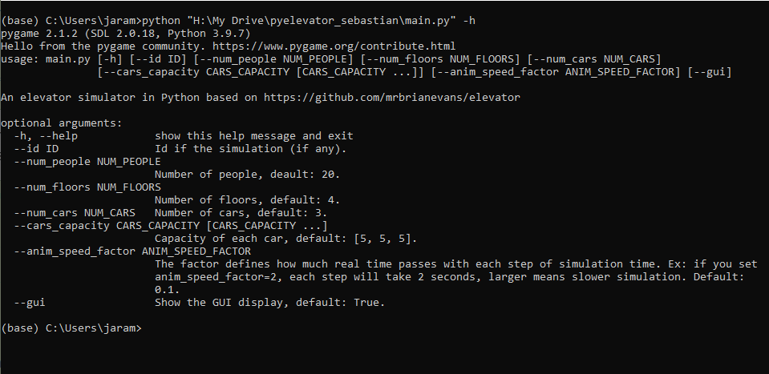
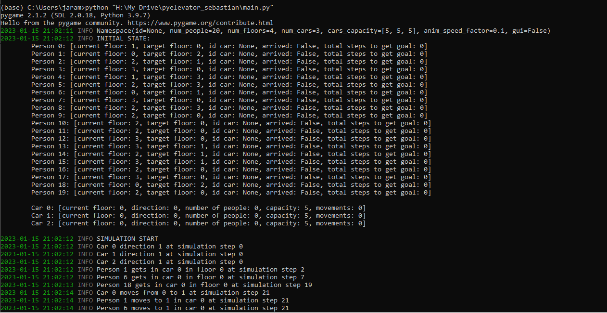
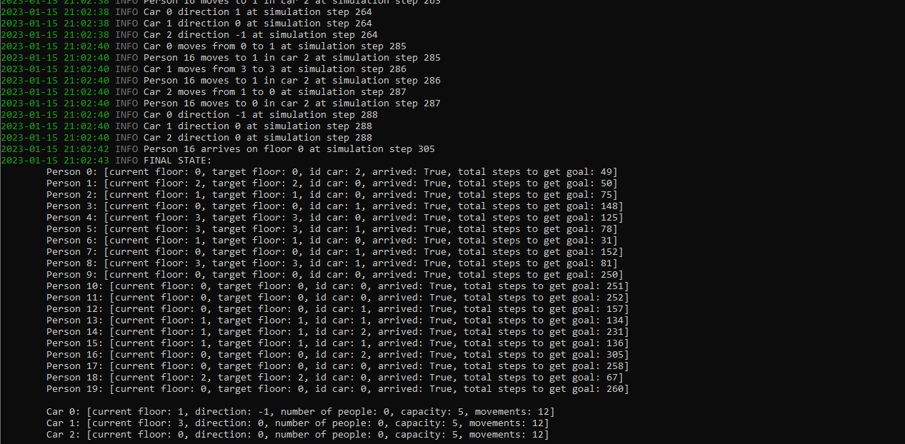

# Elevator Simulator

## Description
In this project I am simulating elevator algorithms in Python.
Animation is handled by [pygame 2.1.2](https://www.pygame.org/docs/), and simulation is done through [simpy 4.0.1](https://simpy.readthedocs.io/en/latest).

We use model-view-controller architecture to develop this simulator. In the [controller folder](controller), there are two agents that can control the cars:

- `baseline` - This simple agent moves the car from bottom to top and vice versa.
- `random` - This agent moves the car randomly (default probability 0.5 to up and 0.5 to down).

## How to run this code 

To run this simulator, you only need to execute [main file](main.py).

The arguments that you can set are in the following picture:

Immediately, you can see the entered arguments when the [main file](main.py) is executed after the initial state is printed, and then the simulation start.
This simulation start from step 0 and each change in the simulation is shown using the package logging.

Finally, you can see the final state, which includes a simulation summary. 

## GUI

The below figure shows a GUI example of this elevator simulator of a building with 4 floors. There are 3 cars (black rectangles), 5 people in the cars (blue points), 10 people who arrived to the target floor (green points), and 5 people waiting for a car (red points).

