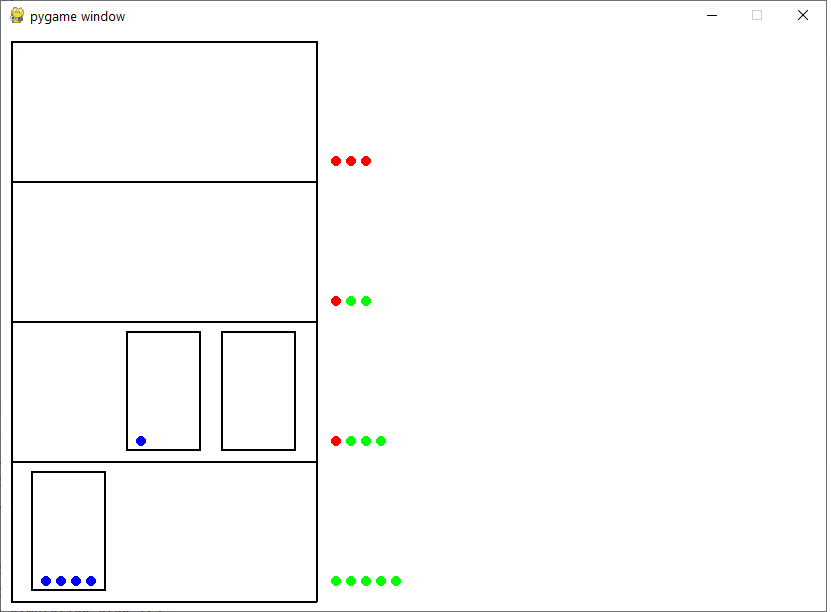

# Elevator Simulator

This is a multi-elevator simulator in Python. Simulation is done through [simpy](https://simpy.readthedocs.io/en/latest) library (v4.0.1), whereas the graphical animation is realized using [pygame](https://www.pygame.org/docs/) library (v2.1.2).

The system was inspired by the [mrbrianevans/elevator](https://github.com/mrbrianevans/elevator) simulator.

## Setup

Code has been tested with Python 8, version 4.0.1 of [simpy](https://simpy.readthedocs.io/en/latest) library, and v2.1.2 of [pygame](https://www.pygame.org/docs/) library, but should work with more updated versions.

To get the required libraries:

```shell
$ pip install -r requirements.txt
```


## How to run this code

To run this simulator, you only need to execute [main file](main.py):

```shell
$ python main.py
```

Use `-h` to list all available options:

```shell
pygame 2.1.2 (SDL 2.0.16, Python 3.10.12)
Hello from the pygame community. https://www.pygame.org/contribute.html
usage: main.py [-h] [--id ID] [--num-people NUM_PEOPLE] [--num-floors NUM_FLOORS] [--num-cars NUM_CARS]
               [--cars-capacity CARS_CAPACITY [CARS_CAPACITY ...]] [--anim_speed_factor ANIM_SPEED_FACTOR] [--gui]

An multi-elevator simulator in Python

options:
  -h, --help            show this help message and exit
  --id ID               Id if the simulation (if any).
  --num-people NUM_PEOPLE, -p NUM_PEOPLE
                        Total number of people to be served (Default: 20)
  --num-floors NUM_FLOORS, -f NUM_FLOORS
                        Number of floors (Default: 4)
  --num-cars NUM_CARS, -c NUM_CARS
                        Number of cars (Default: 3)
  --cars-capacity CARS_CAPACITY [CARS_CAPACITY ...], -cc CARS_CAPACITY [CARS_CAPACITY ...]
                        Capacity of each car (Default: [5, 5, 5])
  --anim_speed_factor ANIM_SPEED_FACTOR, -s ANIM_SPEED_FACTOR
                        The factor defines how much real time passes with each step of simulation time. Ex: if you set anim_speed_factor=2, each
                        step will take 2 seconds, larger means slower simulation. Default: 0.1.
  --gui                 Show the GUI display (Default: False)
```

At the start of the simulation, you can see the values of the simulation parameters as well as the the initial state:

```shell
2024-06-14 19:26:18 INFO Namespace(id=None, num_people=20, num_floors=4, num_cars=3, cars_capacity=[5, 5, 5], anim_speed_factor=0.1, gui=True)
2024-06-14 19:26:19 INFO INITIAL STATE:
 Id simulation: None
	Person 0: [current floor: 3, target floor: 2, id car: None, arrived: False, total steps to get goal: 0]
	Person 1: [current floor: 1, target floor: 2, id car: None, arrived: False, total steps to get goal: 0]
	Person 2: [current floor: 1, target floor: 2, id car: None, arrived: False, total steps to get goal: 0]
	Person 3: [current floor: 2, target floor: 0, id car: None, arrived: False, total steps to get goal: 0]
	Person 4: [current floor: 1, target floor: 3, id car: None, arrived: False, total steps to get goal: 0]
	Person 5: [current floor: 0, target floor: 1, id car: None, arrived: False, total steps to get goal: 0]
	Person 6: [current floor: 3, target floor: 0, id car: None, arrived: False, total steps to get goal: 0]
	Person 7: [current floor: 3, target floor: 1, id car: None, arrived: False, total steps to get goal: 0]
	Person 8: [current floor: 1, target floor: 0, id car: None, arrived: False, total steps to get goal: 0]
	Person 9: [current floor: 0, target floor: 2, id car: None, arrived: False, total steps to get goal: 0]
	Person 10: [current floor: 0, target floor: 1, id car: None, arrived: False, total steps to get goal: 0]
	Person 11: [current floor: 0, target floor: 1, id car: None, arrived: False, total steps to get goal: 0]
	Person 12: [current floor: 0, target floor: 1, id car: None, arrived: False, total steps to get goal: 0]
	Person 13: [current floor: 0, target floor: 2, id car: None, arrived: False, total steps to get goal: 0]
	Person 14: [current floor: 3, target floor: 1, id car: None, arrived: False, total steps to get goal: 0]
	Person 15: [current floor: 3, target floor: 2, id car: None, arrived: False, total steps to get goal: 0]
	Person 16: [current floor: 1, target floor: 3, id car: None, arrived: False, total steps to get goal: 0]
	Person 17: [current floor: 3, target floor: 2, id car: None, arrived: False, total steps to get goal: 0]
	Person 18: [current floor: 2, target floor: 0, id car: None, arrived: False, total steps to get goal: 0]
	Person 19: [current floor: 3, target floor: 2, id car: None, arrived: False, total steps to get goal: 0]

	Car 0: [current floor: 0, direction: 0, number of people: 0, capacity: 5, movements: 0]
	Car 1: [current floor: 0, direction: 0, number of people: 0, capacity: 5, movements: 0]
	Car 2: [current floor: 0, direction: 0, number of people: 0, capacity: 5, movements: 0]
```


This simulation start from step 0 and each change in the simulation is logged on console:

```shell
2024-06-14 19:26:19 INFO SIMULATION START
2024-06-14 19:26:19 INFO Car 0 direction 0 at simulation step 0
2024-06-14 19:26:19 INFO Car 1 direction 1 at simulation step 0
2024-06-14 19:26:19 INFO Car 2 direction 0 at simulation step 0
2024-06-14 19:26:19 INFO Person 5 gets in car 1 in floor 0 at simulation step 6
2024-06-14 19:26:19 INFO Person 9 gets in car 1 in floor 0 at simulation step 10
2024-06-14 19:26:19 INFO Person 10 gets in car 1 in floor 0 at simulation step 11
2024-06-14 19:26:19 INFO Person 11 gets in car 1 in floor 0 at simulation step 12
2024-06-14 19:26:20 INFO Person 12 gets in car 1 in floor 0 at simulation step 13
2024-06-14 19:26:20 INFO Car 0 moves from 0 to 0 at simulation step 21
2024-06-14 19:26:20 INFO Person 5 moves to 0 in car 1 at simulation step 21
2024-06-14 19:26:20 INFO Person 9 moves to 0 in car 1 at simulation step 21
2024-06-14 19:26:20 INFO Person 10 moves to 0 in car 1 at simulation step 21
2024-06-14 19:26:20 INFO Person 11 moves to 0 in car 1 at simulation step 21
2024-06-14 19:26:20 INFO Person 12 moves to 0 in car 1 at simulation step 21
2024-06-14 19:26:20 INFO Car 1 moves from 0 to 1 at simulation step 22
2024-06-14 19:26:20 INFO Person 5 moves to 1 in car 1 at simulation step 22
2024-06-14 19:26:20 INFO Person 9 moves to 1 in car 1 at simulation step 22
2024-06-14 19:26:20 INFO Person 10 moves to 1 in car 1 at simulation step 22
2024-06-14 19:26:20 INFO Person 11 moves to 1 in car 1 at simulation step 22
2024-06-14 19:26:20 INFO Person 12 moves to 1 in car 1 at simulation step 22
2024-06-14 19:26:21 INFO Car 2 moves from 0 to 0 at simulation step 23
...
...
...
```


At the end, the final state and some simulation summary is reported:

```shell
024-06-14 19:36:07 INFO FINAL STATE:
 Id simulation: None
	Person 0: [current floor: 3, target floor: 3, id car: 1, arrived: True, total steps to get goal: 73]
	Person 1: [current floor: 2, target floor: 2, id car: 1, arrived: True, total steps to get goal: 146]
	Person 2: [current floor: 1, target floor: 1, id car: 1, arrived: True, total steps to get goal: 219]
	Person 3: [current floor: 3, target floor: 3, id car: 1, arrived: True, total steps to get goal: 172]
	Person 4: [current floor: 1, target floor: 1, id car: 1, arrived: True, total steps to get goal: 221]
	Person 5: [current floor: 0, target floor: 0, id car: 2, arrived: True, total steps to get goal: 54]
	Person 6: [current floor: 2, target floor: 2, id car: 1, arrived: True, total steps to get goal: 151]
	Person 7: [current floor: 1, target floor: 1, id car: 2, arrived: True, total steps to get goal: 152]
	Person 8: [current floor: 2, target floor: 2, id car: 1, arrived: True, total steps to get goal: 57]
	Person 9: [current floor: 0, target floor: 0, id car: 2, arrived: True, total steps to get goal: 58]
	Person 10: [current floor: 1, target floor: 1, id car: 1, arrived: True, total steps to get goal: 35]
	Person 11: [current floor: 0, target floor: 0, id car: 2, arrived: True, total steps to get goal: 60]
	Person 12: [current floor: 2, target floor: 2, id car: 1, arrived: True, total steps to get goal: 61]
	Person 13: [current floor: 0, target floor: 0, id car: 2, arrived: True, total steps to get goal: 62]
	Person 14: [current floor: 2, target floor: 2, id car: 1, arrived: True, total steps to get goal: 63]
	Person 15: [current floor: 0, target floor: 0, id car: 1, arrived: True, total steps to get goal: 256]
	Person 16: [current floor: 3, target floor: 3, id car: 1, arrived: True, total steps to get goal: 89]
	Person 17: [current floor: 3, target floor: 3, id car: 2, arrived: True, total steps to get goal: 498]
	Person 18: [current floor: 1, target floor: 1, id car: 1, arrived: True, total steps to get goal: 235]
	Person 19: [current floor: 2, target floor: 2, id car: 1, arrived: True, total steps to get goal: 212]

	Car 0: [current floor: 3, direction: -1, number of people: 0, capacity: 5, movements: 20]
	Car 1: [current floor: 2, direction: 1, number of people: 0, capacity: 5, movements: 20]
	Car 2: [current floor: 3, direction: 0, number of people: 0, capacity: 5, movements: 20]
```


## GUI Display

The simulation can be tracked graphically as it progressed: 



In this example, the building has 4 floors, there are 3 elevator cars (black rectangles), 5 people on-board of two cars (blue points), 10 people who have arrived to their target floors (green points), and 5 people still waiting for a car (red points).


## Implementation details

We use **model-view-controller architecture** to develop this simulator. In the [controller folder](controller/), there are two agents that can control the cars:

- `baseline` - This simple agent moves the car from bottom to top and vice versa.
- `random` - This agent moves the car randomly (default probability 0.5 to up and 0.5 to down).


## Contributions

- Andres Jaramillo
- Sardina Sardina (ssardina@gmail.com)